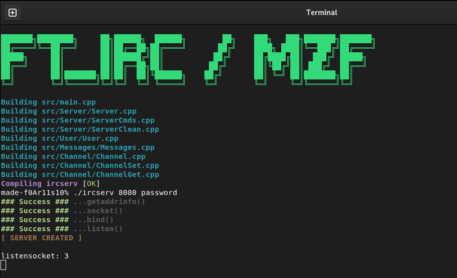

# ft_irc

Server IRC done with [Florian Bily](https://github.com/fbily42) & [Zakariya Hamdouchi](https://github.com/Zheylkoss) (see subject.pdf)





## Usage/Examples

```
make
./ircserv port password
```
- IRC Server done for client irssi (version 1.2.3)
- Handle commands `KICK`, `JOIN`, `INVITE`, `TOPIC` and `MODE` (i,t,k,o,l)
- Handle file transfert with `DCC` command

## Documentation used

- [Modern IRC documentation](https://modern.ircdocs.horse)
- [ircv3](https://ircv3.net/specs/extensions/capability-negotiation.html)
- [poll](https://man7.org/linux/man-pages/man2/poll.2.html)
- [poll](https://www.ibm.com/docs/en/i/7.1?topic=designs-using-poll-instead-select)
- [listen](http://manpagesfr.free.fr/man/man2/listen.2.html)
- [socket](https://www.geeksforgeeks.org/socket-programming-cc/)
- [socket](https://www.bogotobogo.com/cplusplus/sockets_server_client.php)
